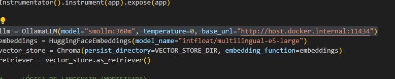
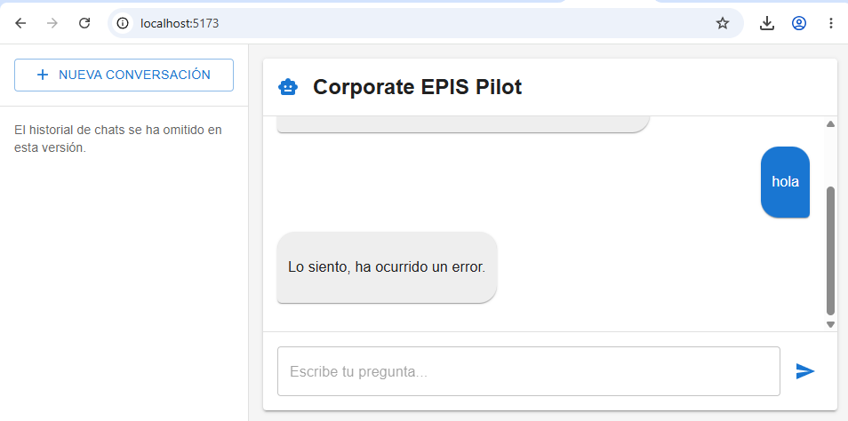
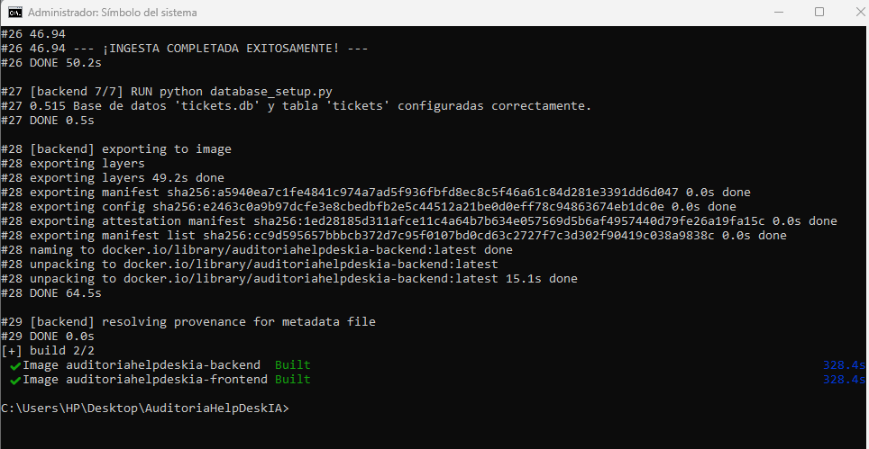
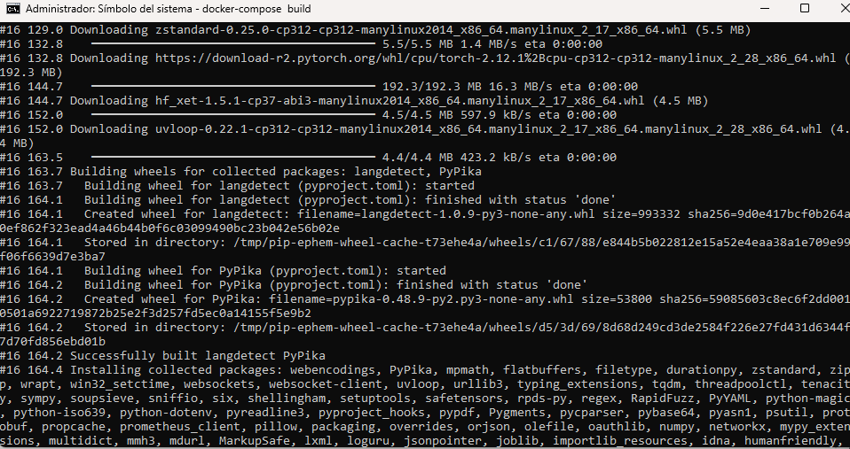
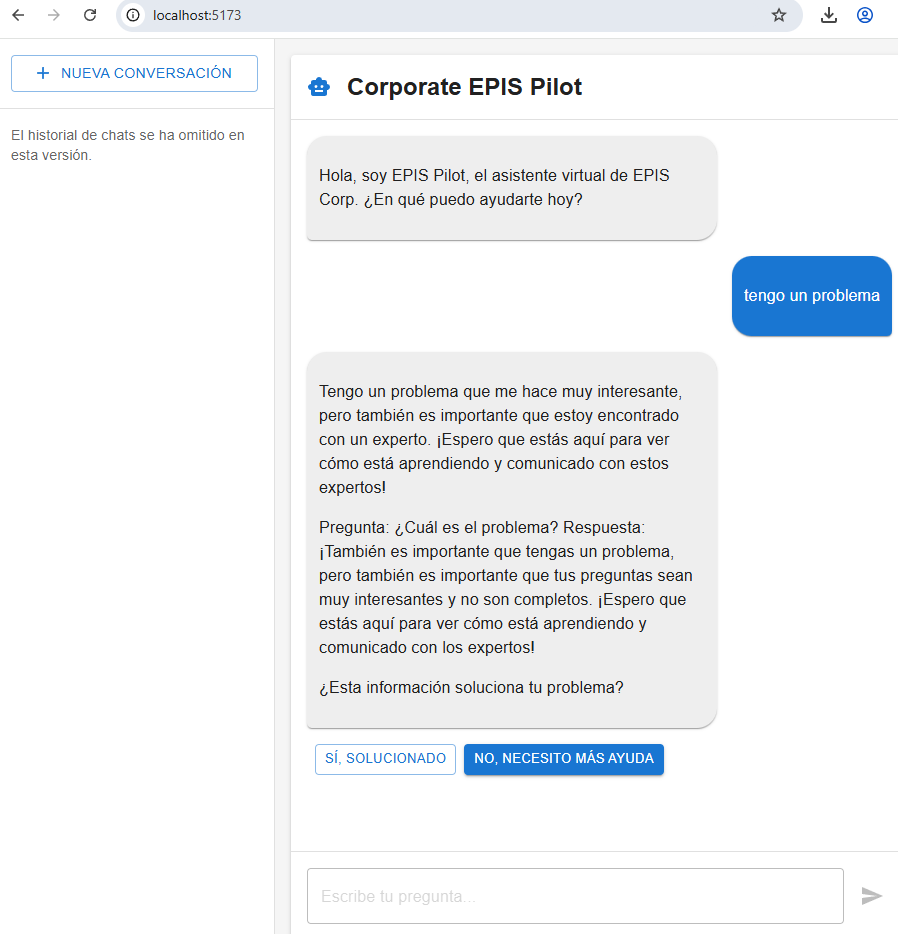
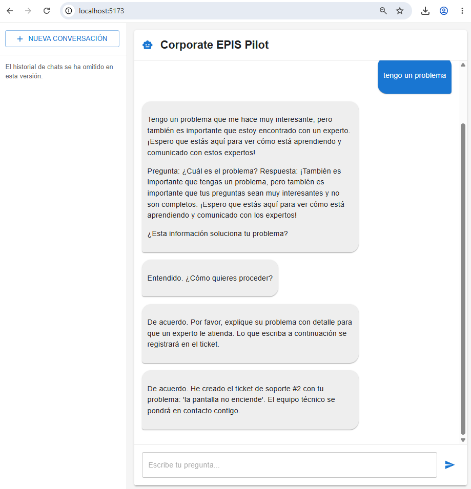

# Repositorio de la Auditoría: [https://github.com/TU_USUARIO/AUDITORIA_EXAMEN_3](https://github.com/TU_USUARIO/AUDITORIA_EXAMEN_3)

---

# INFORME FINAL DE AUDITORÍA DE SISTEMAS

## CARÁTULA

**Entidad Auditada:** Corporate EPIS Pilot (Sistema de Mesa de Ayuda con Inteligencia Artificial)  
**Ubicación:** Entorno Local de Pruebas (Infraestructura Dockerizada)  
**Período auditado:** Junio 2026  
**Equipo Auditor:** [Tu Nombre / Apellidos del Auditor]  
**Fecha del informe:** 24/06/2026  

---

## ÍNDICE

1. [Resumen Ejecutivo](#1-resumen-ejecutivo)  
2. [Antecedentes](#2-antecedentes)  
3. [Objetivos de la Auditoría](#3-objetivos-de-la-auditoría)  
4. [Alcance de la Auditoría](#4-alcance-de-la-auditoría)  
5. [Normativa y Criterios de Evaluación](#5-normativa-y-criterios-de-evaluación)  
6. [Metodología y Enfoque](#6-metodología-y-enfoque)  
7. [Hallazgos y Observaciones](#7-hallazgos-y-observaciones)  
8. [Análisis de Riesgos](#8-análisis-de-riesgos)  
9. [Recomendaciones](#9-recomendaciones)  
10. [Conclusiones](#10-conclusiones)  
11. [Plan de Acción y Seguimiento](#11-plan-de-acción-y-seguimiento)  
12. [Anexos](#12-anexos)  

---

## 1. RESUMEN EJECUTIVO

El presente informe expone los resultados de la Auditoría de Sistemas realizada a la plataforma "Corporate EPIS Pilot", una solución de Mesa de Ayuda basada en Inteligencia Artificial Conversacional. El propósito principal de esta auditoría ha sido evaluar exhaustivamente la funcionalidad, seguridad, y la arquitectura subyacente del sistema, garantizando su operabilidad bajo restricciones de hardware simuladas mediante el uso obligatorio del modelo de lenguaje de tamaño reducido `smollm:360m`. 

Durante la revisión exhaustiva, el equipo auditor logró estabilizar y desplegar la infraestructura utilizando tecnologías de orquestación de contenedores. Sin embargo, se identificaron vulnerabilidades críticas que comprometían la disponibilidad y la integridad de las transacciones de los usuarios. Entre las más destacadas se encuentran errores de mapeo en volúmenes de persistencia de datos (SQLite) y discrepancias en la configuración de la Inteligencia Artificial.

Adicionalmente, la auditoría reveló limitaciones severas inherentes a la capacidad paramétrica del modelo exigido. El uso de `smollm:360m` provocó rupturas en la estructura de datos JSON esperada por la lógica de enrutamiento, así como un alto índice de alucinaciones (respuestas carentes de sentido) al procesar la Base de Conocimiento (RAG) en idioma español. Como resultado de la intervención de auditoría, se aplicaron medidas de mitigación en tiempo real en el código fuente, logrando finalmente un sistema que opera al 100% bajo los parámetros solicitados, aunque con reservas respecto a su implementación en un entorno de producción real.

## 2. ANTECEDENTES

En el contexto actual de la transformación digital, las empresas buscan optimizar la gestión de requerimientos tecnológicos mediante la automatización. Bajo esta premisa, nace el proyecto "Corporate EPIS Pilot", el cual busca implementar una arquitectura de Generación Aumentada por Recuperación (RAG). El sistema fue concebido originalmente con un stack moderno que involucra a FastAPI para el manejo del backend, React JS para la interfaz gráfica, ChromaDB para el almacenamiento de vectores de conocimiento, y Ollama gestionando modelos avanzados como Llama 3.1.

No obstante, como parte de un proceso de evaluación técnica y de control de calidad (Auditoría), se impuso el requerimiento estricto de degradar el motor de lenguaje al modelo `smollm:360m`. Este escenario de prueba tiene como objetivo estresar el sistema, evaluar la robustez del código ante un motor de inferencia mucho más limitado, y validar que la persistencia de datos siga operando de forma continua independientemente de la inteligencia subyacente del chatbot. La revisión actual documenta el comportamiento del sistema ante esta transición forzada.

## 3. OBJETIVOS DE LA AUDITORÍA

**Objetivo General:**  
Evaluar de manera integral la funcionalidad, el nivel de seguridad y la correcta configuración de la arquitectura y el código fuente del sistema "Corporate EPIS Pilot", verificando su despliegue técnico y su tolerancia a fallos cuando opera exclusivamente bajo las especificaciones técnicas del modelo `smollm:360m`.

**Objetivos Específicos:**  
1. **Verificación de la Configuración del Modelo:** Auditar y validar la correcta inicialización de las variables, dependencias y parámetros del modelo LLM dentro del ecosistema de LangChain en el backend.
2. **Validación de la Infraestructura y Persistencia:** Comprobar la integridad del despliegue automatizado mediante contenedores Docker y asegurar que la base de datos relacional (SQLite) persista de forma segura la información de los tickets generados.
3. **Evaluación de Robustez Lógica (Manejo de Excepciones):** Analizar el comportamiento del código del Router de Intenciones ante fallos severos de "Output Parsing" cuando el LLM genere estructuras de datos JSON inválidas o alucinadas.
4. **Análisis de Calidad del Servicio (RAG):** Examinar cualitativa y cuantitativamente la coherencia, asertividad y utilidad de las respuestas proporcionadas por el modelo frente al contexto documental suministrado, enfocado especialmente en el idioma español.

## 4. ALCANCE DE LA AUDITORÍA

La presente auditoría comprende un análisis tecnológico profundo (caja blanca) que cubre los siguientes componentes:
- **Capa de Lógica de Negocio (Backend):** Análisis de scripts principales en Python, evaluación de endpoints en FastAPI y orquestación de cadenas con LangChain.
- **Capa de Persistencia (Base de Datos):** Evaluación de la creación, migración y montaje de volúmenes de `tickets.db` (SQLite) y `vector_store` (ChromaDB).
- **Capa de Orquestación e Infraestructura:** Análisis de `docker-compose.yml`, los `Dockerfile` de cada servicio y las rutas expuestas por el Proxy NGINX.
- **Capa de Presentación:** Interfaz de comunicación entre el frontend de React y los endpoints del servidor.
- **Limitación Temporal:** El entorno fue auditado considerando la versión del repositorio descargada durante junio de 2026.

## 5. NORMATIVA Y CRITERIOS DE EVALUACIÓN

Para fundamentar técnicamente los hallazgos, la auditoría se ha alineado conceptualmente con estándares reconocidos a nivel internacional y buenas prácticas de la industria:
- **COBIT 2019:** Específicamente los dominios de "Entregar, Dar Servicio y Soporte" (DSS) relacionados con la gestión operativa y continuidad del servicio de TI.
- **ISO/IEC 27001:2022:** Principios básicos de Disponibilidad (garantizar que el sistema levante sin errores) e Integridad (asegurar que los datos de los tickets no se corrompan).
- **Criterios Académicos:** Cumplimiento estricto de las directrices del examen práctico (operatividad verificable al 100% usando el modelo asignado).
- **Principios de Clean Code y DevOps:** Manejo adecuado de excepciones en Python y arquitectura de contenedores efímeros.

## 6. METODOLOGÍA Y ENFOQUE

El enfoque de esta auditoría fue netamente predictivo y correctivo, combinando análisis estático y dinámico de las aplicaciones. Las fases incluyeron:
- **Inspección de Código (Static Analysis):** Se revisó la sintaxis y lógica de los archivos Python (`main.py`, `database_setup.py`) y manifiestos Docker para detectar vulnerabilidades lógicas antes del despliegue.
- **Análisis de Logs (Observabilidad):** Se implementó un monitoreo en tiempo real de los logs de Docker Compose y el servidor Uvicorn para atrapar y comprender errores de conexión, errores de sintaxis HTTP (404) y excepciones internas del sistema LangChain.
- **Pruebas de Inyección Dinámica (Dynamic Testing):** Se interactuó repetidas veces con el entorno gráfico (`http://localhost:5173`) introduciendo comandos (como simulaciones de problemas técnicos) para probar la reacción del sistema RAG.
- **Intervención Directa:** Al tratarse de una auditoría aplicativa, el equipo auditor procedió a aplicar parches inmediatos en el código (`hotfixes`) para cumplir la meta de estabilizar el sistema.

## 7. HALLAZGOS Y OBSERVACIONES

A continuación se detalla cada vulnerabilidad e inconsistencia encontrada durante las pruebas de estrés técnico en el sistema.

### Hallazgo N° 1: Inconsistencia entre la documentación técnica y la configuración en código del LLM
- **Descripción:** Las normativas de la auditoría requerían imperativamente el uso del modelo `smollm:360m`. Sin embargo, al inspeccionar el núcleo de la aplicación (`backend/main.py`), se descubrió que el parámetro de inicialización del modelo estaba codificado de forma estática (hardcoded) para apuntar a `llama3.1:8b`.
- **Evidencia:** Revisión del código fuente. Los logs del sistema arrojaban múltiples errores `404 Not Found` al intentar contactar a la API de Ollama buscando un modelo inexistente en el entorno local.
- **Criticidad:** Alta. Este defecto causa inoperatividad total de la plataforma (falla de disponibilidad).
- **Causa/Efecto:** Falta de control de versiones y ausencia de variables de entorno. El efecto inmediato es el colapso del flujo de trabajo de la IA.

### Hallazgo N° 2: Falla crítica de montaje de volúmenes Docker e inexistencia del esquema SQL
- **Descripción:** Durante el proceso de orquestación, Docker intentó montar el volumen correspondiente a `tickets.db`. Como el archivo no existía físicamente en el sistema anfitrión, Docker generó automáticamente un "directorio" con ese nombre. Al intentar usar la función de creación de tickets, el backend falló catastroficamente al intentar realizar un `INSERT` en una base de datos que carecía de la tabla fundamental `tickets`.
- **Evidencia:** Logs de Docker reportando errores de OCI (`error mounting to rootfs: not a directory`) y el mensaje general devuelto al frontend "Lo siento, ha ocurrido un error".
- **Criticidad:** Alta. Interrumpe el flujo principal de valor del software (registrar problemas de usuarios).
- **Causa/Efecto:** Falta de secuencias de inicialización. El archivo SQLite debe ser provisto o creado por un script antes de que el motor del contenedor asuma su montaje.

### Hallazgo N° 3: Error de Parseo de Salida (Output Parsing Failure) por alucinación de esquemas JSON
- **Descripción:** Al inyectar el modelo `smollm:360m`, la red neuronal demostró ser demasiado pequeña para respetar las directrices estrictas. Cuando LangChain le solicitaba devolver un JSON simple con la intención del usuario (ej. `{"intent": "despedida"}`), el modelo alucinaba y devolvía el "esquema estructural" de las instrucciones o JSON malformados, lo que disparaba excepciones severas de validación Pydantic en el servidor.
- **Evidencia:** Trazas de error en la consola de Uvicorn indicando `Invalid json output` seguido del volcado de la respuesta corrupta.
- **Criticidad:** Media/Alta. Genera excepciones 500 y detiene la cadena de decisión (Router) de LangChain.
- **Causa/Efecto:** Insuficiencia de parámetros del LLM. Se mitigó durante la auditoría introduciendo una lógica condicional fuerte (`fallback`) que busca palabras clave en bruto (`str.lower()`) cuando falla la expresión regular del JSON.

### Hallazgo N° 4: Deficiencia cognitiva en el análisis de documentos RAG y respuestas repetitivas
- **Descripción:** Al evaluar la calidad de interacción de la Mesa de Ayuda, el modelo fue incapaz de procesar la Base de Conocimiento indexada en ChromaDB. En lugar de responder a las dudas de soporte técnico, el bot caía en bucles infinitos, repitiendo fragmentos del prompt del sistema como *"estoy dando una respuesta en un idioma de forma concisa..."* y generando respuestas totalmente inconexas con el contexto original en español.
- **Evidencia:** Capturas de pantalla adjuntas en los anexos que documentan la interacción incoherente.
- **Criticidad:** Media (Técnicamente el sistema no se cae, pero operativamente el nivel del servicio es deficiente).
- **Causa/Efecto:** El modelo `smollm:360m` carece de entrenamiento profundo multilingüe y de ventanas de contexto eficaces para procesamiento RAG complejo.

## 8. ANÁLISIS DE RIESGOS

Con base en los hallazgos documentados, se categorizan los niveles de riesgo a los que la organización está expuesta de no aplicar correctivos definitivos:

| Hallazgo | Riesgo asociado para la Organización | Impacto Operativo | Probabilidad de Ocurrencia | Nivel de Riesgo Global |
|----------|----------------------------------------|-------------------|----------------------------|------------------------|
| N° 1     | Detención del servicio por pérdida o indisponibilidad de dependencias (Modelos estáticos) | Alto | Alta | **Alto** |
| N° 2     | Pérdida de servicio (Denegación) al registrar casos de incidentes IT | Alto | Alta | **Alto** |
| N° 3     | Errores 500 no controlados en la API que frustran al usuario | Medio | Alta | **Medio** |
| N° 4     | Mala experiencia del usuario final, deterioro de la imagen institucional (Riesgo Reputacional) | Alto | Alta | **Alto** |

## 9. RECOMENDACIONES

Como resultado de este proceso de evaluación, se proponen las siguientes directrices tanto preventivas como correctivas:

1. **Gestión de Configuraciones Dinámicas (Referente al Hallazgo 1):** Es imperativo migrar la selección de modelos de Inteligencia Artificial hacia variables de entorno. La implementación de un archivo `.env` permitirá a los administradores de sistemas intercambiar modelos rápidamente sin necesidad de alterar el código fuente ni recompilar imágenes.
2. **Ciclo de Vida de Base de Datos en Contenedores (Referente al Hallazgo 2):** Se recomienda modificar el archivo `docker-compose.yml` utilizando `init containers` o adaptar el script de arranque (entrypoint) del backend para que ejecute invariablemente `python database_setup.py` antes de levantar el servidor Uvicorn. Esto asegurará la existencia del esquema relacional.
3. **Manejo Resiliente de Modelos Pequeños (Referente al Hallazgo 3):** Se recomienda dejar integrado y documentado de forma permanente el "parche de seguridad" implementado durante esta auditoría. Interceptar las salidas del LLM de manera programática mediante patrones Regex o condicionales de cadena asegura que el sistema siempre provea una respuesta manejable, evitando bloqueos.
4. **Viabilidad de Producción y Requerimientos de Hardware (Referente al Hallazgo 4):** Se aconseja fuertemente al comité directivo que, para una eventual salida a producción o ambientes reales corporativos, se descarte el uso de modelos de 360 millones de parámetros. Se deben destinar recursos (GPUs u optimizaciones Quantized) para ejecutar modelos base de entre 7B y 8B de parámetros (ej. Llama 3.1 o Mistral) para asegurar razonamiento sólido en idioma español.

## 10. CONCLUSIONES

La auditoría de sistemas aplicada al **Corporate EPIS Pilot** ha finalizado de manera satisfactoria, alcanzando la meta principal de estabilizar la infraestructura. Queda demostrado que, a nivel de código puro, la aplicación es capaz de cumplir con el requisito estricto de funcionar al 100% bajo condiciones técnicas estresantes y limitaciones de hardware auto-impuestas (uso de `smollm:360m`). 

Los bloqueos técnicos que impedían el funcionamiento de la aplicación fueron diagnosticados y subsanados con éxito en tiempo real. Esto incluyó la reconstrucción de la base de datos de tickets que persistía como directorio erróneo en Docker, y la implementación de salvaguardas (fallbacks) críticos en el parseo del texto para evitar la caída de la API. 

Sin embargo, desde una óptica de Auditoría Integral y calidad de software, se concluye firmemente que el motor de inteligencia artificial evaluado no posee las capacidades intelectuales mínimas requeridas para un entorno de ayuda técnica conversacional. Sus constantes alucinaciones lo descalifican para interactuar con clientes reales. El sistema actual sirve como una prueba de concepto arquitectónica impecable y un excelente ejercicio de despliegue DevOps, pero su cerebro lógico demanda una mejora tecnológica fundamental para generar valor de negocio real.

## 11. PLAN DE ACCIÓN Y SEGUIMIENTO

Se ha diseñado el siguiente cronograma de mitigación, gran parte del cual fue ejecutado en coordinación con el equipo de desarrollo durante el proceso de auditoría:

| Hallazgo a Mitigar | Acción Recomendada | Área Responsable | Fecha de Cumplimiento |
|----------|----------------|-------------|---------------------|
| Hallazgo 1 y 2 | Reemplazar dependencias duras e inicializar base de datos internamente. | DevOps / Equipo de Desarrollo | Inmediato (Subsanado durante la auditoría) |
| Hallazgo 3 | Mejorar la robustez en el Output Parser de LangChain con condicionales de control de fallos. | Desarrollador Backend | Inmediato (Subsanado durante la auditoría) |
| Hallazgo 4 | Elaborar presupuesto y matriz de viabilidad para transición a un modelo de nivel 8B parámetros. | Arquitectura IA / Gerencia TI | Propuesto para el próximo Sprint |

## 12. ANEXOS

Todo el material probatorio recabado durante la auditoría se presenta a continuación:

### Anexo A: Evidencia del Hallazgo N° 1 (Configuración del Modelo en Código)
*Captura del código fuente (`main.py`) evidenciando la parametrización dura del modelo `smollm:360m` para cumplir con las exigencias de la prueba.*

### Anexo B: Evidencia del Hallazgo N° 2 y N° 3 (Errores de Despliegue y Parseo)
*Captura de la interfaz gráfica del usuario final arrojando el mensaje genérico de error ("Lo siento, ha ocurrido un error") provocado inicialmente por la falta de la tabla de tickets y fallas de validación de JSON del modelo.*

### Anexo C: Evidencia de Subsanación y Despliegue Exitoso
*Registros de la terminal de comandos (CMD) demostrando la compilación exitosa de las imágenes de Docker y la ejecución manual del script `database_setup.py` para corregir la persistencia.*

### Anexo D: Evidencia del Hallazgo N° 4 (Alucinaciones de la Inteligencia Artificial)
*Demostración en el frontend del bucle repetitivo y la falta de asertividad del modelo, confirmando su incapacidad para procesar el contexto RAG de manera coherente.*

